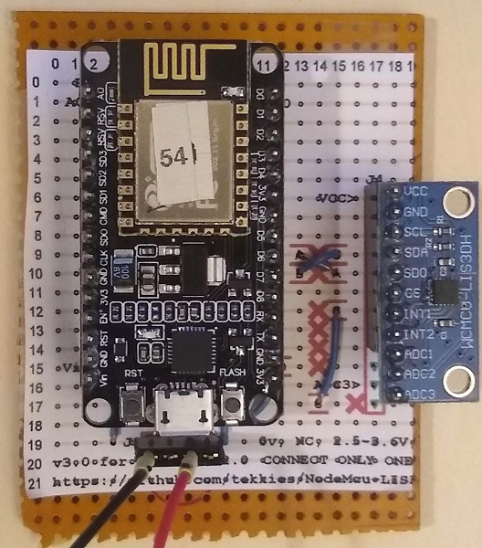
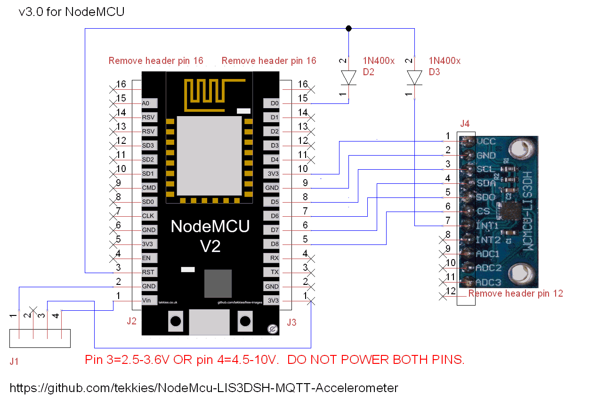
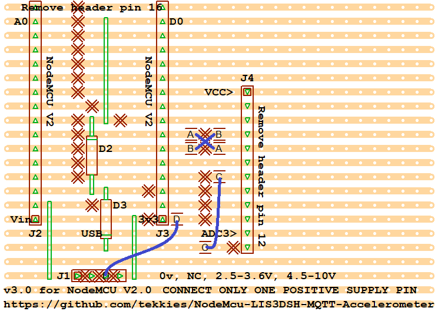

# NodeMcu-LIS3DSH-MQTT-Accelerometer

Low poer, triggers MQTT post on movement detected by custom state machine in LIS3DSH 3-axis accelerometer.

* **Currently only Y and Z Axis** (My X-axis sensor is not working - replacement LIS3DSH on order)
* **Deep sleep** between samples
  * <30uA With [NodeMCU V2 Ultra-Low Power Mod ](https://github.com/tekkies/NodeMCU-V2-ulta-low-power-mod)
  * Adjustable wake sensitivity
  * Adjustable timed polling
* Power by 2xAA Cells or 4.5-10V or USB
* **Wake** on motion by **interrupt**
* NodeMCu V2 board layout
* Written in LUA
* Event-based so **kind to WiFi processes**
* LED Flash codes for PANIC situations (See [src/constants.lua](src/constants.lua))
* Power plug situated by USB to prevent USB and battery connection simultaneously
* With static IP, device wakes for typically 1.02 seconds to read LIS3DSH and post data to MQTT (measured by oscilloscope)

  

## ToDo
- [ ] Fix the memory leak when running with 0 sleep (workaround: sleep for 1 second)

### Circuit

### Stripboard Design

## Tips

* Disconnect the LIS3DSH and reboot - you have a few seconds during the panic flash code to execute `file.remove("init.lua")` so you can get in and reprogram.

## First Time NodeMCU?

See my [Getting Started](https://gist.github.com/tekkies/1f49c744080a6ece0effd3dc23099825) guide

### Firmware

You will need appropriate firmware installed on the NodeMCU. See comments at the top of [lis3dsh.lua](src/lis3dsh.lua) for a download link.

### WiFi Connection

See [Setting up Wifi (DHCP)](https://gist.github.com/tekkies/1f49c744080a6ece0effd3dc23099825#setting-up-wifi-dhcp)

## Observations

* WiFi connection times based on tmr.now()
* From deep-sleep, DHCP takes 1.7-1.8 seconds
* From power-on DHCP takes 4.1-4.5 seconds
* Fromdeep-sleep, Static ip takes 800-855ms
  * Device completes all tasksad goes back to sleep in 904-920ms
* From power-on, Static ip takes 3.6 seconds
