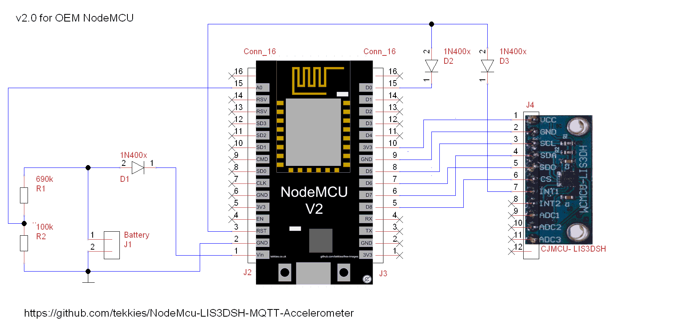
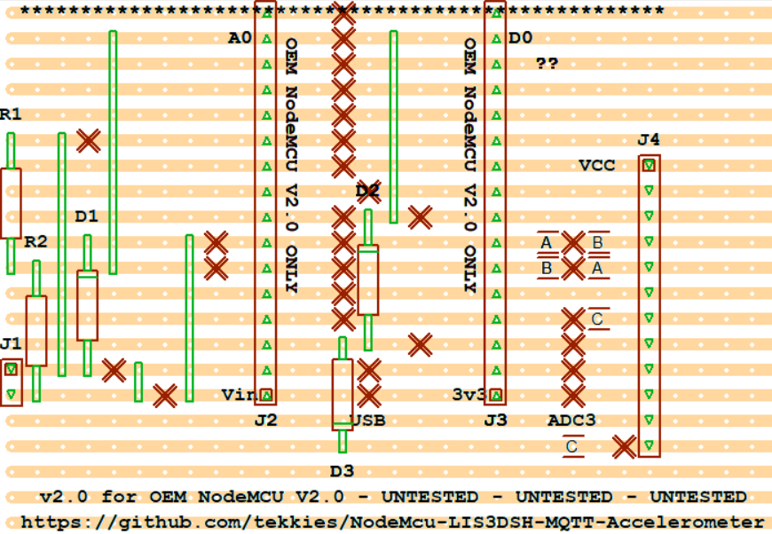

# NodeMcu-LIS3DSH-MQTT-Accelerometer

Periodically polls LIS3DSH accelerometer ove SPI and pubishes to MQTT Broker

* **Currently only Y and Z Axis** (My X-axis sensor is not working - replacement LIS3DSH on order)
* Deep sleep between timed samples
* Wake on motion by interrupt
* Battery level sensor
* Written in LUA
* Event-based so kind to WiFi processes
* Runs only once when battery disconnected (i.e. when debugging on USB)
* LED Flash codes for PANIC situations (See [src/constants.lua](src/constants.lua))

## ToDo
- [_] Fix the memory leak when running with 0 sleep (workaround: sleep for 1 second)
- [_] Light sensor on LIS3DH ADC

## OEM NodeMCU v2.0 

### Circuit

### Stripboard Design

Connect 4x AA batteries to J1, + to the top, - to the bottom.

## Modified NodeMCU V2.0 - Ultra Low Power

**WARNING - Disconnect Battery when using external USB** (otherise power could feed back through the battery)

By modifying the NodeMCU v2.0 PCB (removing the regulator and disconnecting U2 power), the NodeMCY only draws about 20μA at 3.3v.  A flying lead can also be attached to allow programming via USB, if the lead is connected to 3.3v.

### Modifying NodeMCU V2.0

1. Remove the regulator marked YELLOW
2. Cut the 3.3v supply track to the USB IC on the front of of the PCB - marked RED
3. Solder a flying lead to the bottom left of the capacitor - marked BLUE

It should look something like this

### Programming Mode

In order to program the modified NodeMCU, **disconnect the battery**, connect the flying lead to a 3.3v pin, provide 3.3v power to the NodeMCU and plug in the USB connector.

An easy way to achieve this is using another NodeMCU v2.0
