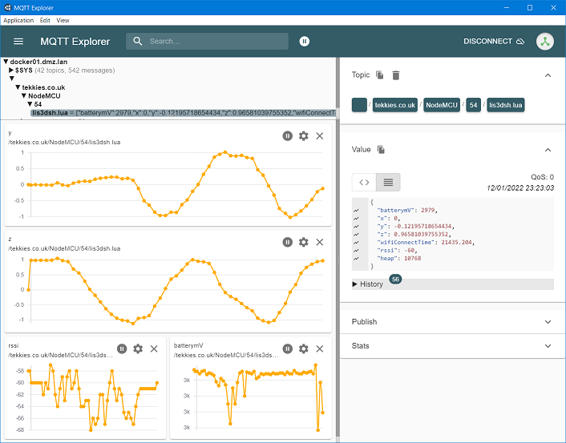

# NodeMcu-LIS3DSH-MQTT-Accelerometer

Periodically polls LIS3DSH accelerometer ove SPI and pubishes to MQTT Broker

* Deep sleep between samples
* Battery level sensor
* Written in LUA
* Event-based so kind to WiFi processes
* Runs only once when battery disconnected (i.e. when debugging on USB)
* LED Flash codes for PANIC situations

## ToDo
- [ ] Sleep the LIS3DSH

## Design

[Source](https://www.circuit-diagram.org/circuits/bc4837dfeb004d6ab27e804357bb4d59)

