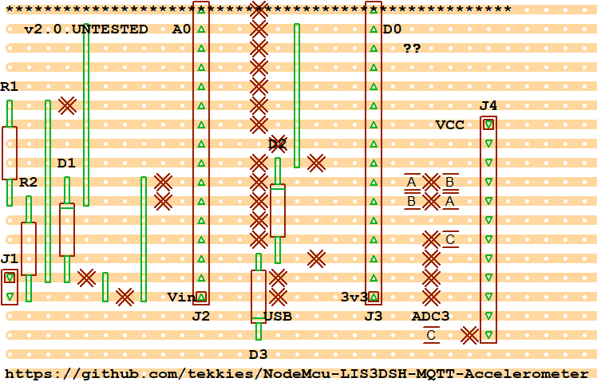

# NodeMcu-LIS3DSH-MQTT-Accelerometer

Periodically polls LIS3DSH accelerometer ove SPI and pubishes to MQTT Broker

* Deep sleep between samples
* Battery level sensor
* Written in LUA
* Event-based so kind to WiFi processes
* Runs only once when battery disconnected (i.e. when debugging on USB)
* LED Flash codes for PANIC situations

## ToDo
- [ ] Sleep the LIS3DSH

## Design

### Circuit

### Layout

Connect 4x AA batteries to J1, + to the top, - to the bottom.

